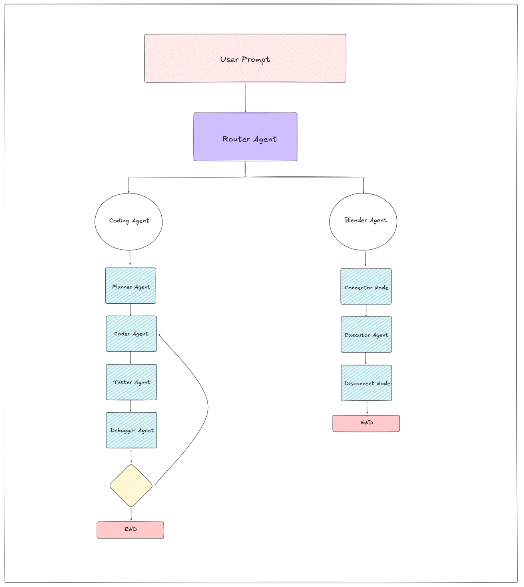

# Autonomous Agentic Model for Coding and 3D Rendering


## Project Overview

This project introduces a sophisticated autonomous agentic model engineered to comprehend and execute a diverse range of user requests across two primary domains: software development and 3D rendering with Blender. Leveraging the power of Large Language Models (LLMs) and the LangChain framework, this system can seamlessly delegate tasks to specialized agents, ensuring a fluid and intuitive user experience without the need for manual intervention.

At its core, the model employs a hierarchical agent architecture. A central **Planner Agent** acts as an intelligent router, analyzing user intent and dispatching tasks to either a dedicated **Coding Agent** or a **Blender Agent**. This allows for a clear separation of concerns and enables the system to handle complex, multi-domain workflows efficiently.

### Key Features

* **Intelligent Task Routing:** A Planner Agent that accurately classifies user intent for either coding or Blender-related tasks.
* **Specialized Coding Agent:** A robust agent for code generation, review, debugging, and technical inquiries.
* **Interactive Blender Agent:** A specialized agent that interfaces with Blender through a Remote Procedure Call (RPC) server to manipulate 3D scenes based on natural language commands.
* **Conversational Context:** Utilizes LangChain's memory capabilities to maintain a coherent conversational history, allowing for follow-up questions and iterative task refinement.
* **Scalable Architecture:** Built on a modular design that allows for the future integration of new tools and agent capabilities.

## Problem Statement

The domain of AI-powered assistants is often fragmented, with models typically excelling in either software development or creative tasks like 3D graphics, but rarely both. This limitation necessitates manual switching between different systems, creating a disjointed user experience. This project addresses this gap by creating a unified, multi-domain intelligent system capable of autonomously discerning and executing tasks in both the coding and 3D rendering landscapes.

## System Architecture

The model is built upon a foundation of modern AI and software development technologies:

### Core Technologies

* **Programming Language:** Python 3.10+
* **AI Framework:** LangChain
* **Language Models:** Compatible with OpenAI LLMs or other custom Large Language Models.
* **3D Graphics Software:** Blender (3.x or higher recommended)
* **Inter-Process Communication:** Socket-based RPC for communication between the Blender Agent and the Blender application.
* **Diagramming:** Excalidraw for flowchart visualization.

### Architectural Flow

The project's workflow is visualized in the flowchart below, created with Excalidraw.



## Detailed Component Explanation

### Planner Agent

The Planner Agent is the central nervous system of the model. Its primary responsibilities are:

* **Intent Classification:** To analyze the user's prompt and determine whether the request pertains to coding or Blender.
* **Task Delegation:** To route the request to the appropriate specialized agent (Coding or Blender).
* **Context Management:** To ensure that the conversational history, managed by LangChain Memory, is passed to the relevant agent for context-aware execution.

### Coding Agent

The Coding Agent is a specialized sub-agent designed to handle all software development-related tasks. Its capabilities include:

* **Code Generation:** Writing new code snippets, functions, or entire classes based on user specifications.
* **Code Review and Refactoring:** Analyzing existing code for bugs, suggesting improvements, and applying best practices.
* **Technical Assistance:** Answering programming questions and explaining complex concepts.

This agent leverages the power of a fine-tuned LLM to understand and generate high-quality code.

### Blender Agent

The Blender Agent is responsible for all 3D rendering and manipulation tasks. It operates by:

* **Receiving Instructions:** Accepting high-level commands from the Planner Agent.
* **Generating Blender Scripts:** Translating natural language commands into executable Python scripts for Blender.
* **RPC Communication:** Sending these scripts to a running Blender instance via a socket-based RPC server.

To function correctly, Blender must be running with the `blender_server.py` script, which listens for and executes incoming commands.

### Socket Communication

A robust TCP/IP socket connection facilitates communication between the Blender Agent and the Blender server. Task instructions are serialized into a structured format (e.g., JSON) for reliable transmission and execution. This allows for real-time control of the Blender environment from the agentic model.

## Local Setup and Installation

### Prerequisites

* Python 3.10 or newer
* Blender (3.x or higher, with Python scripting enabled)
* Git for version control
* A virtual environment manager such as `venv` or `conda`.

### Installation Guide

1.  **Clone the Repository:**
    ```bash
    git clone https://github.com/SharathK4/autonomous_coding_agent.git 
    cd autonomous_coding_agent
    ```

2.  **Create and Activate a Virtual Environment:**
    ```bash
    python -m venv venv
    source venv/bin/activate  # On Windows, use `venv\Scripts\activate`
    ```

3.  **Install Dependencies:**
    ```bash
    pip install -r requirements.txt
    ```

4.  **Set Up Environment Variables:**
    Create a `.env` file in the root directory and add your API keys:
    ```
    OPENAI_API_KEY="your-openai-api-key"  #OR
    GOOGLE_API_KEY="your-google-api-key"  #recommended to use this
    ```

5.  **Run the Blender Server:**
    Open a separate terminal and start the Blender server:
    ```bash
    blender --python blender_server.py

    #Eg: "C:\Program Files\Blender Foundation\Blender 4.4\blender.exe" --python startup/blender_server_startup.py
    ```

6.  **Launch the Main Application:**
    In your original terminal, run the main application:
    ```bash
    python main.py
    ```

You can now interact with the autonomous agentic model through the command line.
